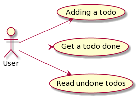
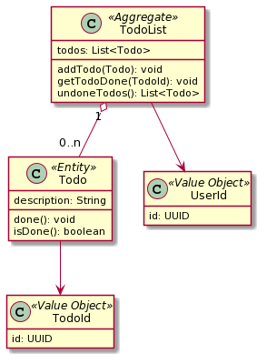
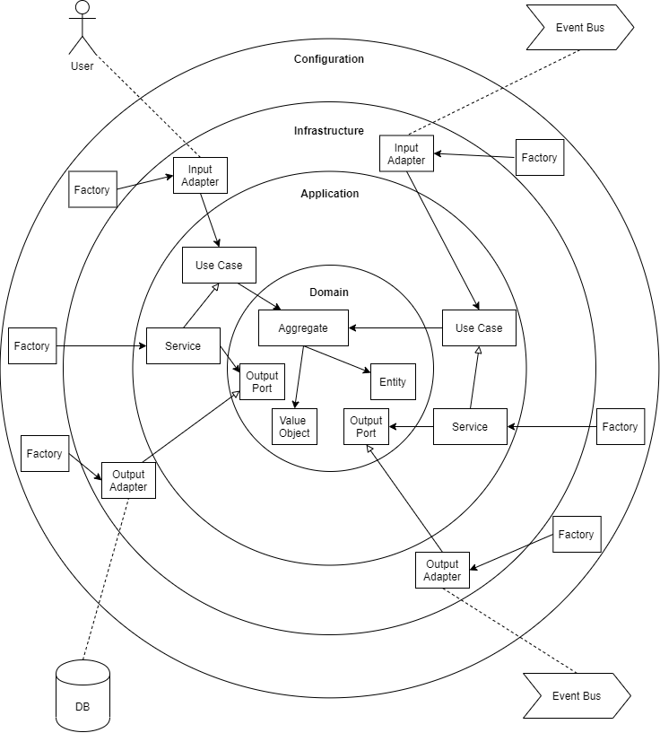

# Daily Family Tradegy - a Hands on Domain Driven Design & Clean Architecture

There are many different styles and interpretations of _Domain Driven Design_ (aka DDD) and the _Clean Architecture_ out there.
This example should be a proof of concept how these to concepts can fit together and how _DDD_ can lead us to a clean architecture that focuses on the business (domain).
The intention here is not to find the best overall solution for anybody, but to find a good and clear way for me.

## Strategic Design
The main idea of _Domain Driven Design_ is about understading the appropriate domain. Therefore we'll bringt the domain experts and the developer together to explain the required know-how of a domain to the people that will build the software.
A good way to do this is a method called _Domain Storytelling_. The result will give us a good overview about the actors, the activities and work objects.
The separation of the actors and processes can give us a good indicator to find a _Bounded Context_.
One of the most important things is the _Ubiquitous Language_. This allows us to find the same words in the software that the domain exports uses when telling about their domain
  

### Domain Storytelling 
The domain experts - the storrytellers - are telling a story about their domain works to the developers. This story we'll be drawn by a moderator. At the end everybody we'll be able to tell this story and so about the domain workflows by viewing on the drawing.

#### The Scenario
A wife asks her wife to fix the clogged drain. The wife is a little absent-minded and forgets about it. After a while the wife asks her wife whether the task is done and the wife has to confess that she has forgotten the task. 
That makes her angry and she complains to her wife. 
So the wife takes a heart and adds the todo to a todo list.
As soon she has a little spare time she wants to get an overview about her open todos. 
When the todo is done, she sets this todo to done. 
Finally, the wife and her wife are both very happy and still married...

### Bounded Contexts
It seems that one good Bounded Context could be the `Todo Management`. It should support the husband to getting his todos done.

Because of this example seems to be very simple, we are not having any other _Subdomains_ or _Bounded Contexts_ here. Otherwise the next step would be making up a _Context Map_.

### Use Cases
Let's have a closer look at the operations that the husband performs to the _Bounded Context_ - these are the use cases.

### Event Storming
After we identified the Bounded Context. The next step is to get more into that context. Therefore we choosed a method called `Event Storming`.

Now it is more clear, what each command needs as input data and which domain events occur.

### Domain Objects
The domain is the heart of our application and contains the entities, aggregates and value objects. In our example we had already identified the following objects:

* User (known as 'husband')
* Todo
* Todo List

## Tactical Design
In The tatical design we're defining what the types the domain objects are like. This can be e.g. _Aggregates_, _Entities_, _Value Objects_, _Factories_, _Services_ or _Repositories_.

The identified domain objects leads us to the following structure:

### Clean Architecture
We want to follow the _Clean Architecture_. There are many different diagrams out there, but for me the following one makes it more clear for me.

### Domain Layer
First, we're implementing the domain objects located in `domain` layer. After that we're implementing the _Domain Services_ that have access to the _Domain Repositories_, etc. These services itselves are stateless and have access to our domain objects and can let them change their states. They are also located in the `domain` layer. There are also `Ports` (interfaces) that allows us to interact with the environment, like database or an external event bus (see infrastructure layer).

### Application Layer
In the `application` layer there are only two different types. The first one are interfaces and are called `Use Cases`. It describes how an actor would interact with our domain software. The second are `Application Services` that are implementing the Use Cases and orchestrating the domain logic.

Until here there is no need are any framework or third party libary. Keep your `domain` and your `application` layer clean!

### Infrastructure Layer
In the `infrastructure` layer we can now add the (microservice-)framework, like _Spring Boot_, to get our business application run. Furthermore, we can here implement the required ports from the `domain` layer in classes called `Adapters`.

If do so, our application is very robust when we're updating dependencies or switching technologies, like `database` integration. Then we're just having to rewrite a new adapter and that's it!

## Testing
Let's see, if our tests runs: `./gradlew clean cJ test accT`

### Testing the Use Cases (using Cucumber)
We are finding the acceptance tests based on _Gherkin & Cucumber_ under the path `src/test-acceptance`. The purpose of these tests is to make sure that the use cases that we implemented in the `application` layer working fine.

To run the acceptance tests there is a gradle task under `gradle/test-acceptance.gradle`.

### Testing the Architecture (using ArchUnit)
We are finding the architecture tests based on _ArchUnit_ under the path `src/test-architecture`. The purpose of these tests is to make sure that our source code follows the rules and structure given by _DDD_ and the _Onion Architecture_.

To run the architecture tests there is a gradle task under `gradle/test-architecture.gradle`. These tests will always be executed after the `test` task runs.

## Tooling & Further Links

| Purpose | Tool | Link |
| --- | --- | --- |
| Domain Storrytelling | WPS Domain Storrytelling Modeler | https://www.wps.de/modeler/ |
| Creating Diagrams | Draw.io | https://app.diagrams.net/ |
| Event Stroming | Miro | https://miro.com/ |
| UML Modelling | PlantUML | https://plantuml.com/ |

Links:
| Topic | Link |
| --- | --- |
| Domain Storrytelling Book | https://leanpub.com/domainstorytelling |
| DDD Example | https://leasingninja.github.io/ |
| Clean Architecture | https://blog.cleancoder.com/uncle-bob/2012/08/13/the-clean-architecture.html |
