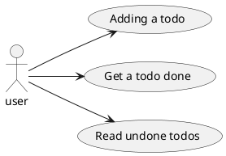
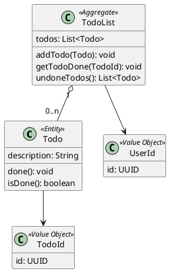

# UML Diagrams based on PlantUML

## Use Cases 

```plantuml
@startuml usecases

left to right direction

actor user as User
usecase (Adding a todo) as UC1
usecase (Get a todo done) as UC2
usecase (Read undone todos) as UC3

User --> UC1
User --> UC2
User --> UC3

@enduml
```

## Domain Objects

```plantuml
@startuml domain-objects

class Todo <<Entity>> {
    description: String
    done(): void
    isDone(): boolean
}
class TodoId <<Value Object>> {
    id: UUID
}
class TodoList  <<Aggregate>> {
    todos: List<Todo>
    addTodo(Todo): void
    getTodoDone(TodoId): void
    undoneTodos(): List<Todo>
}
class UserId <<Value Object>> {
    id: UUID
}

Todo --> TodoId
TodoList "1" o-- "0..n" Todo
TodoList --> UserId

hide TodoId methods
hide UserId methods

@enduml
```

